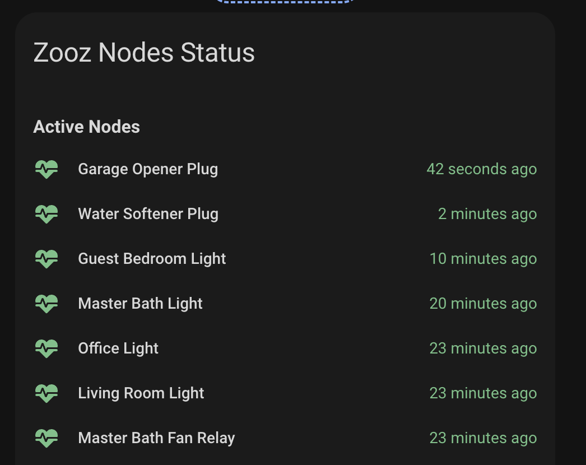

# Zooz Nodes Status Card

A custom card for Home Assistant that displays the status of all your Zooz Z-Wave devices in an organized grid layout. The card categorizes devices into three groups: Active, Sleeping, and Dead nodes, making it easy to monitor your Z-Wave network's health.


## Features

- Groups Zooz devices by their current status (Active, Sleeping, Dead)
- Displays last seen timestamp for each device
- Color-coded status indicators for quick visual reference
- Customizable grid layout (1-3 columns)
- Responsive design that works on both desktop and mobile
- Easy configuration through the Home Assistant UI

## Configuration

| Name     | Type   | Default             | Description                                 |
| -------- | ------ | ------------------- | ------------------------------------------- |
| title    | string | "Zooz Nodes Status" | Card title                                  |
| columns  | number | 3                   | Number of columns in the grid (1-3)         |
| features | list   | See below           | Optional flags to toggle different features |

### Feature Options

| Name    | Type | Description                |
| ------- | ---- | -------------------------- |
| compact | flag | Make the view more compact |

Compact Card:


## Usage

1. Install the card in your Home Assistant instance
2. Add the card to your dashboard through the UI
3. Configure the card settings if needed (title and number of columns)

Example configuration in YAML:

```yaml
type: custom:zooz-nodes-status
```

```yaml
type: custom:zooz-nodes-status
title: My Zooz Devices
columns: 2
```

## Status Indicators

- 🟢 Green: Device is active and recently seen
- 🟡 Amber: Device is sleeping or hasn't been seen in 2-24 hours
- 🔴 Red: Device is dead or hasn't been seen in over 24 hours

## Requirements

- Home Assistant
- At least one Zooz Z-Wave device
- Z-Wave integration configured in Home Assistant

## Support

For issues and feature requests, please visit the [GitHub repository](https://github.com/homeassistant-extras/zooz-card-set).
